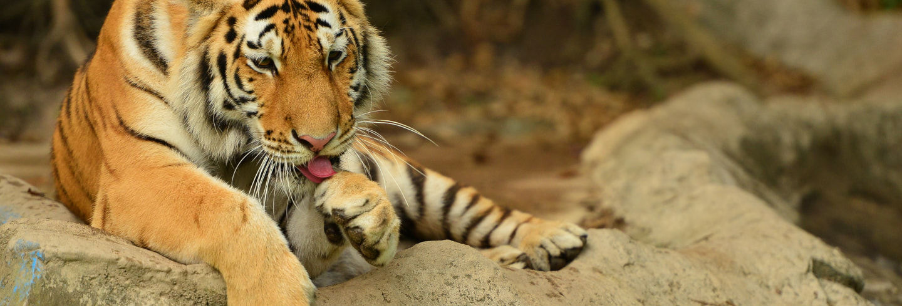
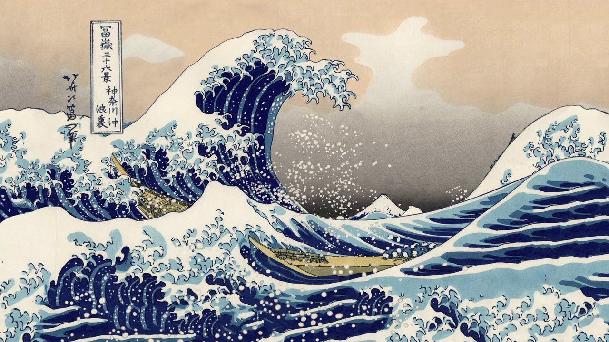
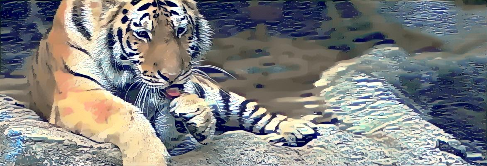

# style-transfer-vgg16
Tried to implement [Gatys & Others](https://www.cv-foundation.org/openaccess/content_cvpr_2016/papers/Gatys_Image_Style_Transfer_CVPR_2016_paper.pdf]) paper about transfering image style using CNN.  
The paper uses VGG16 net.

# Files
## src/train.py
Executes de style transfer process.
## src/model.py
Loads VGG16 net, freezes parameters and changes max pools with average pools.
## src/utils.py
Helpers such as image loader and other required/useful functions.
## src/config.py
Parameters used in the style transfer process. Most important to be known:
- STYLE_WEIGHTS: Weights of each content layer.
- CONTENT_WEIGHT: Don't touch! Importance of content in the final image.
- STYLE_WEIGHT: Importance of the style in the final image. This changes how much the final image gets its style changed.
- STEPS: Number of steps that the model has to run.
- CONTENT_IMAGE: This assumes the image is inside input folder. Name of the image file as content.
- STYLE_IMAGE: This assumes the image is inside input folder. Name of the image file used as style.
- LEARNING_RATE: How content image changes each step. The larger the faster.

# Example
In this example I transfer the Kanagawa's wave style into a tiger's image. Both taken from Google Images.  

Content Image:  
  
     
Style Image:  
   
     
Result:     
 
